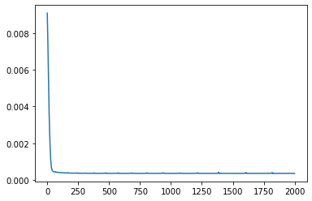
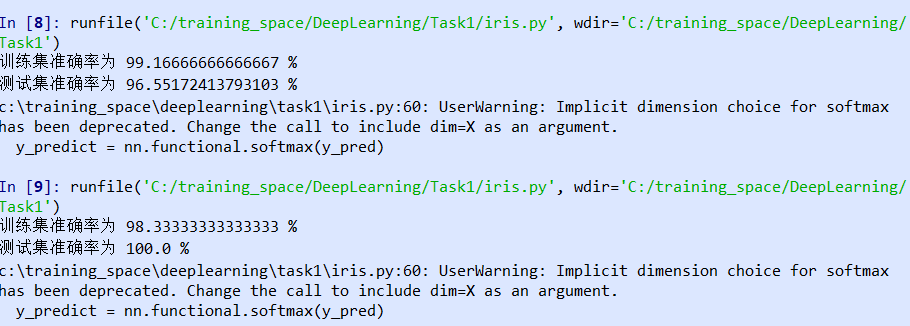

### 搭建全连接神经网络过程
1. 初始化神经网络(神经网络每一层有多少单元,总共多少层)
2. 对于每次循环
    1. forward propagation
    2. backward propagation
    3. gradient descent(选择合适的优化器,学习率)
    4. compute loss(可选)
3. 预测结果
4. 调整超参数(α,神经网络结构之类)使得训练集准确度较高,降低偏差
5. 用一些手段(正则化,dropout,提前结束学习,增加数据...)提升神经网络在验证集上的表现,降低方差

### 运行结果

